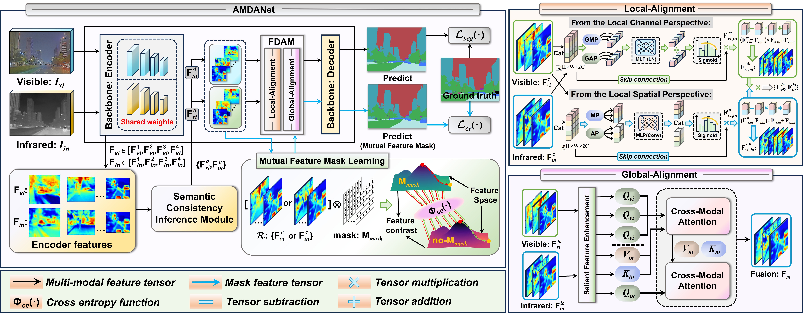

# AMDANet_ICCV 2025
The code of AMDANet: Attention-Driven Multi-Perspective Discrepancy Alignment for RGB-Infrared Image Fusion and Segmentation

## 💥 Motivation
In this work, to achieve precise multimodal semantic segmentation, we propose an Attention-Driven Multimodal Discrepancy Alignment Network (AMDANet). 
AMDANet reallocates weights to reduce the saliency of discrepant features and utilizes low-weight features as cues to mitigate discrepancies between modalities, thereby achieving multimodal feature alignment. 
<p align="center">

</p>


# Training:<br>
* Prepare training data & set the training parameters:<br>
  * Dataset fomula:
  * Dataset name<br>
    ------RGB image folder<br>
    ------Infrared image folder<br>
    ------Ground truth folder<br>
    ------Train.txt<br>
    ------Val.txt<br>
    ------Test.txt<br>
* Datasets can be found at here: [FMB](https://drive.google.com/file/d/1YvxxEjxmd0k49ReyC4PaAWcuhuOmn8Z1/view?usp=sharing), [MFNet](https://www.mi.t.u-tokyo.ac.jp/static/projects/mil_multispectral), [PST900](https://drive.google.com/file/d/1dEULc25OP6fl1FXuUXiEkHSYfDkFcUjv/view?usp=sharing).```<br>
* Run ```CUDA_VISIBLE_DEVICES="GPU IDs" python -m torch.distributed.launch --nproc_per_node="GPU numbers you want to use" train.py```<br>
* Example ```CUDA_VISIBLE_DEVICES=0,1 python -m torch.distributed.launch --nproc_per_node train.py```<br>


# Test:<br>
* Pretrained weights can be found at here: [FMB](https://drive.google.com/drive/folders/17LroKnuEWttvtcbuv-G-DXaXYdua52cN?usp=sharing), [MFNet](https://drive.google.com/drive/folders/1txDn-U04KEKA6gbSUjSsn-QqaN4nFw0Y?usp=sharing), [PST900](https://drive.google.com/drive/folders/1iEu3QZSV-q18u28X4cB7GK8UpLoRhXTX?usp=sharing), place the checkpoints under the corrspanding floder.
* Set the testing parameters:<br>
* Run ```CUDA_VISIBLE_DEVICES="GPU IDs" python eval.py -e="epoch"```<br>
* Example ```CUDA_VISIBLE_DEVICES=0 python eval.py -e=AMDANet```<br>


## Recommended Requirements

```
 - python = 3.8
 - torch = 1.8.1+cu111
 - timm = 0.9.8
 - numpy = 1.24.4
 - scipy = 1.10.1
 - pillow = 10.1.0
 - tqdm = 4.66.1
 - tensorboardX = 2.6.2.2
 - opencv-python = 4.8.1.78
```


## Acknowlegement
_**AMDANet**_ is built upon [SegFormer](https://github.com/NVlabs/SegFormer), [MRFS](https://github.com/HaoZhang1018/MRFS) and [SegMiF](https://github.com/JinyuanLiu-CV/SegMiF). We thank their authors for making the source code publicly available.

````
@InProceedings{Zhong_2025_ICCV,
    author    = {Zhong, Haifeng and Tang, Fan and Chen, Zhuo and Chang, Hyung Jin and Gao, Yixing},
    title     = {AMDANet: Attention-Driven Multi-Perspective Discrepancy Alignment for RGB-Infrared Image Fusion and Segmentation},
    booktitle = {Proceedings of the IEEE/CVF International Conference on Computer Vision (ICCV)},
    month     = {October},
    year      = {2025},
    pages     = {10645-10655}
}
````